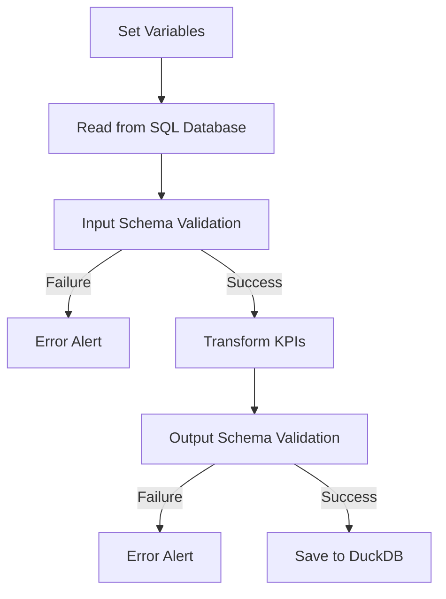

## Flow

Data Contract
::: app.schema.ProductSchema

Transformations
Set Variables
::: app.etl.load_settings

Read from SQL Database
::: app.etl.extract_from_sql

Transform KPIs
::: app.etl.transform